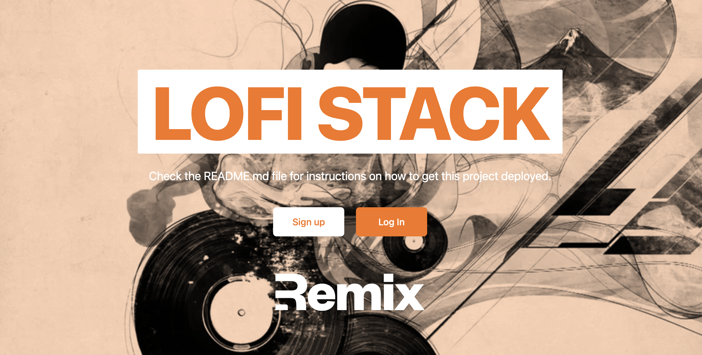

# Remix LoFi Stack
> **Warning**
> Work in progress



Learn more about [Remix Stacks](https://remix.run/stacks).
```
npx create-remix@latest --template macieklad/lofi-stack
```
## Motivation
If you know the original `blues` stack, this will sound familiar to you. What I want my remix projects is the same development speed and tight integration of components that I already get when using Laravel or RoR. What I do not want is the decisions I make a bit later in the project (monitoring, server optimizations, deployment) - with the exception that I still want to easily add them in the future (maybe this project will never get there).

## Principles
- Provide minimal abstractions, but do not hinder productivity
- You get the template, and from then it is your responsibility, this is not a framework
- Provide as much glue as possible, but never force something
- By improving this project, see what can be simplfied and maybe extracted into packages

## What's in the stack
- [Fly deployments](https://fly.io)
- Email/Password Authentication with [cookie-based sessions](https://remix.run/utils/sessions#creatememorysessionstorage)
- Integrated query builder, with migration and codegen scripts [Kysely](https://prisma.io)
- Styling with [Tailwind](https://tailwindcss.com/)
- End-to-end testing with [Playwright](https://playwright.dev)
- Local third party request mocking with [MSW](https://mswjs.io)
- Unit testing with [Vitest](https://vitest.dev) and [Testing Library](https://testing-library.com)
- Code formatting with [Prettier](https://prettier.io)
- Linting with [ESLint](https://eslint.org)
- Static Types with [TypeScript](https://typescriptlang.org)

Not a fan of bits of the stack? Fork it, change it, and use `npx create-remix --template your/repo`! Make it your own.

## Why this instead of that
- Playwright not cypress - more browsers, easier to integrate with remix, no promise chaining API, I could go on
- Kysely instead of Prisma, Drizzle or Knex - really good typing, with tools like Copilot boilerplate is not problematic, Drizzle is still not there yet (for example missing unique constraints on schema level - state for 07.23), also after years I gravitate more towards pure SQL. Also, with ORM you always find some tiny cuts when database model and partial selects do not fit well into model fields, with query builder you see what you get, and use functions instead of classes that operate on raw data. This works well when good boundaries are set up, and types are maximally narrowed, so the code won't bleed while you change it.
- Removed things from blues like prometheus reporting - I do not know how I will monitor my project (but am fairly confident where I'm going). So this should be added with command, but not yet there at the start of the project.
- Added auth with glue code for testing - You almost always need auth, I find myself reimplementing it each itme, instead of deleting it :)

> **Warning**
> Sections below are not yet rewritten
## Quickstart

Click this button to create a [Gitpod](https://gitpod.io) workspace with the project set up, Postgres started, and Fly pre-installed

[](https://gitpod.io/#https://github.com/remix-run/blues-stack/tree/main)

## Development

- Start the Postgres Database in [Docker](https://www.docker.com/get-started):

  ```sh
  npm run docker
  ```

  > **Note:** The npm script will complete while Docker sets up the container in the background. Ensure that Docker has finished and your container is running before proceeding.

- Initial setup:

  ```sh
  npm run setup
  ```

- Run the first build:

  ```sh
  npm run build
  ```

- Start dev server:

  ```sh
  npm run dev
  ```

This starts your app in development mode, rebuilding assets on file changes.

The database seed script creates a new user with some data you can use to get started:

- Email: `rachel@remix.run`
- Password: `racheliscool`

If you'd prefer not to use Docker, you can also use Fly's Wireguard VPN to connect to a development database (or even your production database). You can find the instructions to set up Wireguard [here](https://fly.io/docs/reference/private-networking/#install-your-wireguard-app), and the instructions for creating a development database [here](https://fly.io/docs/reference/postgres/).

### Relevant code:

This is a pretty simple note-taking app, but it's a good example of how you can build a full stack app with Prisma and Remix. The main functionality is creating users, logging in and out, and creating and deleting notes.

- creating users, and logging in and out [./app/models/user.server.ts](./app/models/user.server.ts)
- user sessions, and verifying them [./app/session.server.ts](./app/session.server.ts)
- creating, and deleting notes [./app/models/note.server.ts](./app/models/note.server.ts)

## Deployment

This Remix Stack comes with two GitHub Actions that handle automatically deploying your app to production and staging environments.

Prior to your first deployment, you'll need to do a few things:

- [Install Fly](https://fly.io/docs/getting-started/installing-flyctl/)

- Sign up and log in to Fly

  ```sh
  fly auth signup
  ```

  > **Note:** If you have more than one Fly account, ensure that you are signed into the same account in the Fly CLI as you are in the browser. In your terminal, run `fly auth whoami` and ensure the email matches the Fly account signed into the browser.

- Create two apps on Fly, one for staging and one for production:

  ```sh
  fly apps create soul-stack-d84c
  fly apps create soul-stack-d84c-staging
  ```

  > **Note:** Once you've successfully created an app, double-check the `fly.toml` file to ensure that the `app` key is the name of the production app you created. This Stack [automatically appends a unique suffix at init](https://github.com/remix-run/blues-stack/blob/4c2f1af416b539187beb8126dd16f6bc38f47639/remix.init/index.js#L29) which may not match the apps you created on Fly. You will likely see [404 errors in your Github Actions CI logs](https://community.fly.io/t/404-failure-with-deployment-with-remix-blues-stack/4526/3) if you have this mismatch.

- Initialize Git.

  ```sh
  git init
  ```

- Create a new [GitHub Repository](https://repo.new), and then add it as the remote for your project. **Do not push your app yet!**

  ```sh
  git remote add origin <ORIGIN_URL>
  ```

- Add a `FLY_API_TOKEN` to your GitHub repo. To do this, go to your user settings on Fly and create a new [token](https://web.fly.io/user/personal_access_tokens/new), then add it to [your repo secrets](https://docs.github.com/en/actions/security-guides/encrypted-secrets) with the name `FLY_API_TOKEN`.

- Add a `SESSION_SECRET` to your fly app secrets, to do this you can run the following commands:

  ```sh
  fly secrets set SESSION_SECRET=$(openssl rand -hex 32) --app soul-stack-d84c
  fly secrets set SESSION_SECRET=$(openssl rand -hex 32) --app soul-stack-d84c-staging
  ```

  > **Note:** When creating the staging secret, you may get a warning from the Fly CLI that looks like this:
  >
  > ```
  > WARN app flag 'soul-stack-d84c-staging' does not match app name in config file 'soul-stack-d84c'
  > ```
  >
  > This simply means that the current directory contains a config that references the production app we created in the first step. Ignore this warning and proceed to create the secret.

  If you don't have openssl installed, you can also use [1password](https://1password.com/password-generator/) to generate a random secret, just replace `$(openssl rand -hex 32)` with the generated secret.

- Create a database for both your staging and production environments. Run the following:

  ```sh
  fly postgres create --name soul-stack-d84c-db
  fly postgres attach --app soul-stack-d84c soul-stack-d84c-db

  fly postgres create --name soul-stack-d84c-staging-db
  fly postgres attach --app soul-stack-d84c-staging soul-stack-d84c-staging-db
  ```

  > **Note:** You'll get the same warning for the same reason when attaching the staging database that you did in the `fly set secret` step above. No worries. Proceed!

Fly will take care of setting the `DATABASE_URL` secret for you.

Now that everything is set up you can commit and push your changes to your repo. Every commit to your `main` branch will trigger a deployment to your production environment, and every commit to your `dev` branch will trigger a deployment to your staging environment.

If you run into any issues deploying to Fly, make sure you've followed all of the steps above and if you have, then post as many details about your deployment (including your app name) to [the Fly support community](https://community.fly.io). They're normally pretty responsive over there and hopefully can help resolve any of your deployment issues and questions.

### Multi-region deploys

Once you have your site and database running in a single region, you can add more regions by following [Fly's Scaling](https://fly.io/docs/reference/scaling/) and [Multi-region PostgreSQL](https://fly.io/docs/getting-started/multi-region-databases/) docs.

Make certain to set a `PRIMARY_REGION` environment variable for your app. You can use `[env]` config in the `fly.toml` to set that to the region you want to use as the primary region for both your app and database.

#### Testing your app in other regions

Install the [ModHeader](https://modheader.com/) browser extension (or something similar) and use it to load your app with the header `fly-prefer-region` set to the region name you would like to test.

You can check the `x-fly-region` header on the response to know which region your request was handled by.

## GitHub Actions

We use GitHub Actions for continuous integration and deployment. Anything that gets into the `main` branch will be deployed to production after running tests/build/etc. Anything in the `dev` branch will be deployed to staging.

## Testing

### Cypress

We use Cypress for our End-to-End tests in this project. You'll find those in the `cypress` directory. As you make changes, add to an existing file or create a new file in the `cypress/e2e` directory to test your changes.

We use [`@testing-library/cypress`](https://testing-library.com/cypress) for selecting elements on the page semantically.

To run these tests in development, run `npm run test:e2e:dev` which will start the dev server for the app as well as the Cypress client. Make sure the database is running in docker as described above.

We have a utility for testing authenticated features without having to go through the login flow:

```ts
cy.login();
// you are now logged in as a new user
```

We also have a utility to auto-delete the user at the end of your test. Just make sure to add this in each test file:

```ts
afterEach(() => {
  cy.cleanupUser();
});
```

That way, we can keep your local db clean and keep your tests isolated from one another.

### Vitest

For lower level tests of utilities and individual components, we use `vitest`. We have DOM-specific assertion helpers via [`@testing-library/jest-dom`](https://testing-library.com/jest-dom).

### Type Checking

This project uses TypeScript. It's recommended to get TypeScript set up for your editor to get a really great in-editor experience with type checking and auto-complete. To run type checking across the whole project, run `npm run typecheck`.

### Linting

This project uses ESLint for linting. That is configured in `.eslintrc.js`.

### Formatting

We use [Prettier](https://prettier.io/) for auto-formatting in this project. It's recommended to install an editor plugin (like the [VSCode Prettier plugin](https://marketplace.visualstudio.com/items?itemName=esbenp.prettier-vscode)) to get auto-formatting on save. There's also a `npm run format` script you can run to format all files in the project.
